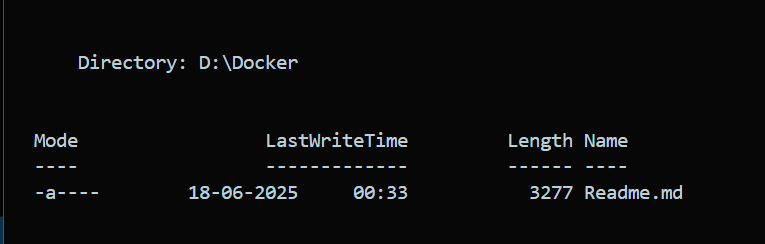
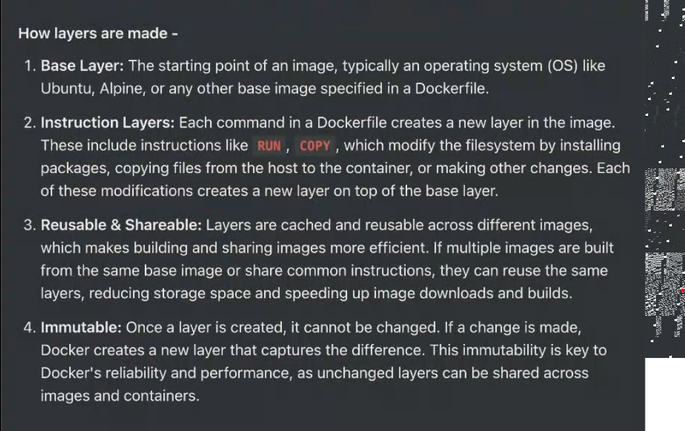
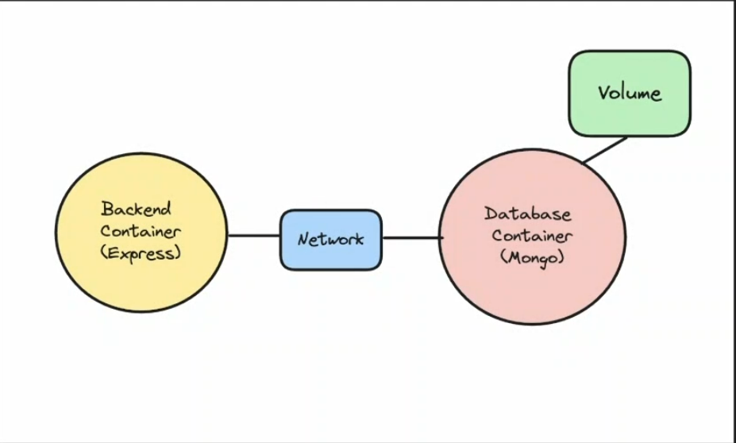

# Learning Docker

> This is the repo i have created for my own learning, which cover the concepts of docker and notes along with it. 

## Steping stone to Kubernetes 
- If you want to run processes in isolated environments, Docker(Containers) let you do so! 
- The benefit of using docker is that the isolated environments cannot talk to eachother and independent.
- If you have one isolated environment you can run 10 different applications on them.
- Starting projects locally/ auxillary services locally.
- Auxilary Services => Postgress

## Containerization in Docker  
- A container is an enviroment, or mini machine working on your main machine. 
- Container is a way to package and distribute software applications in a way that makes them easy to deploy and run consistently across different environments.
- Runs on any machine and runs consistently.

## Example for starting a MongoDB Container
- docker run -d -p 27017:27017 mongo 
- docker is not the only way to create containers, just a popular choice among developers.  
- Docker helps in creating containers, that reduce the hectic way of installing softwares GUI and  fill your computers with the unneccessary softwares, instead it provides you a container which has everything built in, and you can access everything just by a single command. 

## You can push IMAGES to DOCKER REGISTRIES
- Image => Anything you want to expose to the world, for other developers as well. 
- First the image is being created. It is basically a CD drive kind of thing. 
- You can get the images for the registeries locally in your machine. (Dockerhub)
- Image in EXECUTION is called a container.

## Common commands
- docker run (name of file)
- docker ps 
- docker kill

## Port Mapping
- docker run -p 27017:27017 mongo 
- This command will map the machine port to the container port of the mongo image.
- If you don't want to see any logs, you can run the docker to the detach mode by running the command : 
docker run -d -p 27017:27017 mongo
- docker ps command shows the current containers being running
- If you want to stop the container just run the command docker kill (container ID)

## For starting Postgres
- This is the command to start postgres locally on your machine. 
- docker run -e POSTGRES_PASSWORD=mysecretpassword -d -p 5432:5432 postgres  
- -e is for environment variables that is being used to create environment.
- docker run {containerID} is the command to run a container

## Docker Kill
- docker kill {contaainerId} => this command will kill the container
- To remove the image docker rmi {image name} command is being used. 

## DockerFile
- If you want to create an image from your own code, that you can push to dockerhub, you need to create a dockerfile for your application.
- A Dockerfile is a text document that contains all the commands a user could call on the command line to create an image. 

## Basic Boiler Plate Code for Docker File
- FROM node:16-alpine  ==> Base Image
- WORKDIR /app ==> Defining Path for Working Directory.
- COPY .. => This commands takes two argument, First argument is the files of the src directory and copy it to the Working Directory. First argument is basically every files, you can see by doing ls.
- RUN npm install
- RUN npm run build - This is the run command which builds the code.
- EXPOSE 3000 - Expose Ports
- CMD ["node", "dist/index.js"] => Final command that runs while running the container.

- Run command is used to boostrapping the resources like installing node and express, while CMD is used to actually run the containers.
- Node Modules of your root machine is not needed by the image so it is a good practice to keep it inside .dockerignore file.
- After all this the only comman needed to create the image is : docker build -t "tagname" => 
- docker build -t adityaDocker

- 
- Docker is  really good at caching.
- Also, if you're are database inside a container, whenever you'll delete the container the database will also be erased. 
- Pre signed urls are used to send images directly to the aws, whenever a commit is done.

## More Commands
-  docker exec => This command is used to execute a command inside a container.
- docker images => Shows every image being present in your machine.
 
## Layers in Docker
- In Docker, layers are a fundamental part of the image architecture that allows Docker to be efficient, fast and portable. A Docker Image is essentially built up from a series of layers, each representing a set of differences from the previous layer. 
- 
- The power of layers is Caching. As you repeatadly run the command, due to caching the command tend to run faster as compared to the previous time.
- If the base image changes there no use of layers, cause the whole architecture get shattered.
- You can share Layers across images. 
- Whenever you create a Dockerfile, you make sure that across rebuilds the number of cached layers are high than uncached layers.

## More Optimized Docker File Boiler Plate 
FROM node:20

WORKDIR /user/src/app

COPY package* .
COPY ./prisma .

RUN npm install
RUN npx prisma generate

COPY .. 
RUN npm run build

EXPOSE 3000

CMD ["node", "dist/index.js",]

- The things that you change the most has to be at the very end, changing the node modules, package.json is a expensive change.
- This code make sure the expensive step of npm install is being cached.

## Network and Volumes
- Network and volumes are concepts that become important when you have multiple containers running in which you 
1. Need to persist data across docker restarts
2. Need to allow containers to talk to each other 

- Containers are transactory, whatever data you put into it, it goes away as soon as you kill the container.
- Volumes persist even if the container crashes, good use case if of creating volumes for the Database.

## Volumes
- Creating a volume using : docker volume create volume_database
- Mount the folder in mongo which actually stores the data to this volume
docker run -v volume_database:/data/db -p 27017:27017 mongo

## Network  
- In Docker, a Network is a powerful feature that allows containers to communicate with eachother and with the outside world.
- Docker Containers can't talk to eachother by Default. 
- localhost on docker container means it's own network and not the network of the host machine.
- docker network create my_custom_network
1. Start the backend process with the network attached to it. 
docker run -d -p 3000:3000 --name backend --network my_custom_network image_tag
2. Start mongo on the same network
docker run -d -v volume_database:/data/db --name mongo  --network my_custom_network
3. Check logs to ensure DB connection
docker logs <container_id>

## Product Level Docker
p5-js web editor github => https://github.com/processing/p5.js-web-editor

## Docker Compose
- It is a yml file, very similar to JSON. It holds key and values.
- Docker compose is a tool designed to help you define and run multi-container docker applications. With Compose, you use a YAML file to configure your application's services, networks, and volumes. Then, with a single command, you can create and satrt all the services from your configuration.
